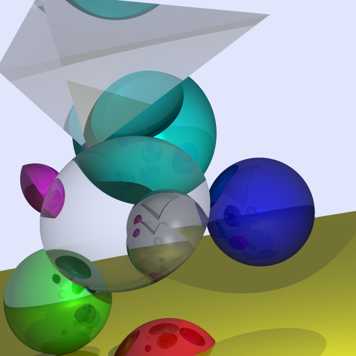

A rust implementation following the book [Computer Graphics from Scratch](https://gabrielgambetta.com/computer-graphics-from-scratch/).

Run `cargo run` to generate output image.

Ray tracing result:
